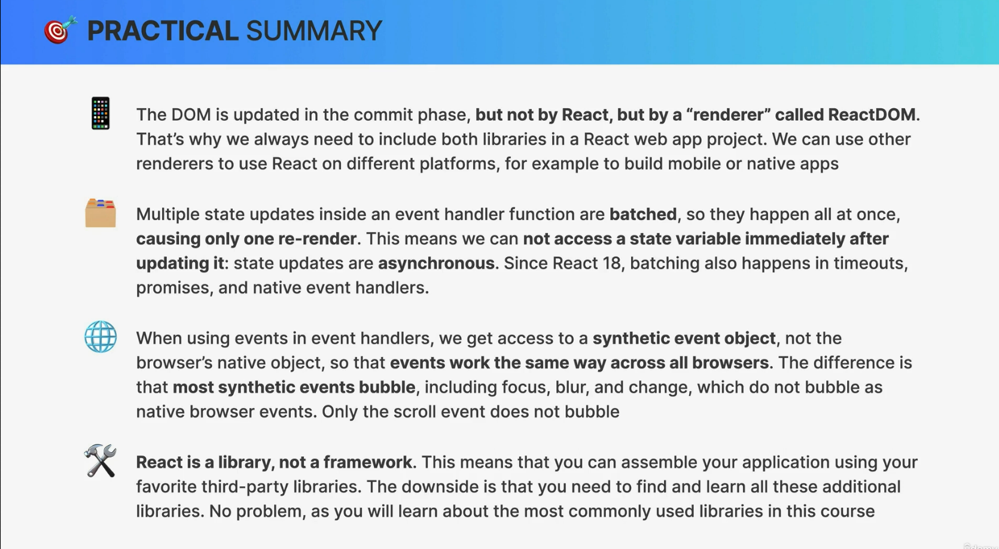
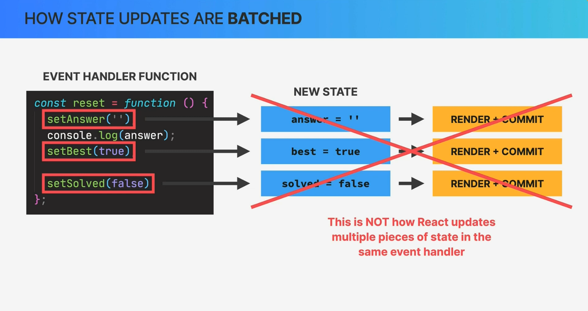
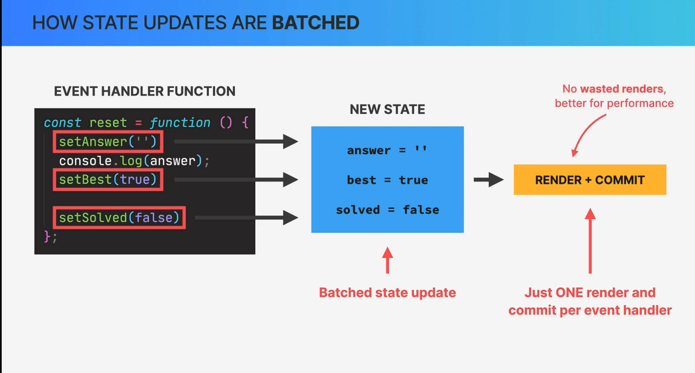

# How rendering works

---------------- Summary -------------------------




---------------- end Summary ----------------------


Rendering in React refers to the process of transforming a component tree, represented by React elements, into a user interface (UI) that is displayed in the browser's Document Object Model (DOM). React uses a virtual DOM (VDOM) to efficiently manage and update this process. Here's an overview of how rendering works in React:

1. **Component Tree Creation**:

   - When you write React code, you define a component tree. This tree consists of components, which are either functional components or class components, and their relationships. You compose this tree by nesting components within one another.

2. **Element Creation**:

   - You use JSX (JavaScript XML) to define React elements. These elements describe what should be rendered to the UI. React elements are lightweight, plain JavaScript objects.

   - When you render a component, React creates a React element for that component and its children. Elements contain information about the component type, its props, and its children.

3. **Virtual DOM (VDOM) Creation**:

   - React maintains a virtual DOM, which is a lightweight representation of the actual DOM. The virtual DOM is a hierarchical structure that mirrors the component tree. It's created by React to keep track of the UI's current state.

   - React elements are used to build the virtual DOM. Each element corresponds to a node in the virtual DOM tree.

4. **Initial Rendering**:

   - When you initially render your React application, React performs an initial render. It traverses the component tree, starting from the root component (usually your main application component), and creates a virtual DOM representation.

   - The virtual DOM is then used to update the actual DOM, resulting in the UI being displayed in the browser.

5. **Reconciliation**:

   - React continuously compares the current virtual DOM with the previous virtual DOM to determine what changes need to be made to the actual DOM to reflect the updated UI.

   - This process is known as reconciliation. React identifies differences (called "diffing") between the current and previous virtual DOM trees and calculates the minimal set of changes needed to update the actual DOM.

6. **Re-rendering**:

   - Whenever the state or props of a component change, React triggers a re-render for that component and its descendants. The component's `render` method (or function in a functional component) is called again to create a new React element.

   - The new element is compared with the previous element to identify differences, and if changes are detected, React updates the virtual DOM and subsequently the actual DOM.

7. **Efficient Updates**:

   - React uses various optimizations, such as a virtual DOM diffing algorithm and a "reconciliation" process, to minimize the number of changes made to the actual DOM. This ensures that updates are performed as efficiently as possible.

By using this process, React provides a highly efficient and performant way to manage UI updates in web applications. It abstracts away many of the complexities of directly manipulating the DOM and helps developers build interactive and dynamic user interfaces.

## component vs instance vs element


In React, "component," "instance," and "element" are related concepts, but they refer to different things in the context of React applications. Let's break down each term:

1. **Component**:

   - **Definition**: A component in React is a reusable, self-contained piece of user interface (UI) that can be composed and combined with other components to build complex user interfaces. Components can be either functional components (created using functions) or class components (created using classes).

   - **Characteristics**: Components can have their own state, props (properties passed from parent components), and lifecycle methods (for class components). They are responsible for rendering UI elements and can contain logic for handling user interactions.

   - **Usage**: Components are used to encapsulate and organize the UI and behavior of your application. They are the building blocks that make up your React application's user interface.

   - **Example**: Below is an example of a functional component called `MyComponent`:

     ```jsx
     function MyComponent(props) {
       return <div>Hello, {props.name}!</div>;
     }
     ```

2. **Instance**:

   - **Definition**: In the context of React components, an instance refers to a specific instance of a class component. When you create a class component using `class MyClassComponent extends React.Component`, you can create multiple instances of `MyClassComponent` by rendering it multiple times.

   - **Characteristics**: Each instance of a class component has its own state and props, independent of other instances of the same component class. These instances can be thought of as individual copies of the same component class.

   - **Usage**: Instances are created and managed by React when you render a class component. You typically don't interact directly with instances in your code but work with components and their props.

3. **Element**:

   - **Definition**: An element in React represents a lightweight, plain JavaScript object that describes what should be rendered to the DOM. Elements are typically created using JSX syntax.

   - **Characteristics**: Elements are simple, plain objects that contain information about a component, its props, and its children. They are not instances of components but are used to describe what the component tree should look like.

   - **Usage**: Elements are used to build the virtual DOM (a lightweight representation of the actual DOM) in React. React uses elements to compare the current and previous virtual DOM representations to efficiently update the actual DOM.

   - **Example**: Below is an example of a React element created using JSX:

     ```jsx
     const element = <div>Hello, React element!</div>;
     ```

In summary, components are the building blocks of your application, instances are individual copies of class components, and elements are plain JavaScript objects used to describe what should be rendered to the DOM. Understanding these distinctions is important for working effectively with React and building complex user interfaces.

## How Diffing Works


React's virtual DOM reconciliation process, often referred to as "diffing," is a crucial part of how React efficiently updates the actual DOM in response to changes in your application's state or props. The goal of diffing is to determine which parts of the virtual DOM have changed and to minimize the number of changes made to the actual DOM to improve performance.

Here's how the diffing algorithm works in React:

1. **Initial Render**:

   - When your React application starts, or when a component is first rendered, React creates a virtual DOM tree that mirrors the component tree. This initial virtual DOM tree is a representation of what the UI should look like.

2. **Subsequent Updates**:

   - When a component's state or props change, React triggers a re-render of that component and its descendants.

   - During this re-render, React creates a new virtual DOM tree that reflects the updated UI state based on the new state and props.

3. **Element Comparison**:

   - React now has two virtual DOM trees: the previous (old) virtual DOM tree and the current (new) virtual DOM tree.

   - React's diffing algorithm compares these two virtual DOM trees element by element, starting at the root of the tree.

4. **Element Types**:

   - React compares elements of the same type. If the types (e.g., component types) of two elements are different, React considers them as completely different and doesn't attempt to update the previous element.

   - React then performs the same type of comparison for the children of these elements.

5. **Keyed Elements**:

   - When rendering lists of elements (e.g., arrays of components), React uses a "key" prop to identify each element uniquely. This key allows React to efficiently update and reorder elements within the list.

   - React compares elements with the same key in the previous and current virtual DOM trees. If the keys match, React assumes the elements represent the same data and proceeds with the comparison.

6. **Updating the DOM**:

   - As React compares elements in the two virtual DOM trees, it identifies differences between them, such as changes in content or attribute values.

   - React generates a set of instructions (a "diff" or "patch") that represents the minimal set of changes required to update the actual DOM to match the new virtual DOM tree.

   - These instructions can include adding, updating, or removing DOM elements and attributes as needed to reflect the new UI state.

7. **Efficient Updates**:

   - React's goal is to minimize the number of changes made to the actual DOM. By computing the minimal set of changes needed, React optimizes performance and ensures that updates are as efficient as possible.

8. **Updating the Actual DOM**:

   - Once React has generated the instructions for updating the actual DOM, it applies these changes to the DOM. This is the point at which the user sees the updated UI.

The key takeaway is that React performs a "diffing" process by comparing the previous and current virtual DOM trees, identifying differences, and applying the necessary updates to the actual DOM. This process is efficient and helps React achieve high performance in managing UI updates. It's one of the reasons why React is well-suited for building dynamic and interactive web applications.

## The Key Prop

## Resetting State With the Key Prop


The `key` prop in React is a special and important prop that is used to uniquely identify elements in lists or collections of elements rendered by React. It plays a crucial role in helping React efficiently update and reorder elements within a list without recreating the entire list. Here's how the `key` prop works and how it can be used to reset state:

### The Key Prop:

1. **Uniqueness**: Each element within a list or collection rendered by React should have a unique `key` prop. This allows React to distinguish between different elements and efficiently update them.

2. **Reordering**: When elements in a list change positions, the `key` prop helps React identify which elements have been moved, added, or removed. It enables React to update the order of elements in the virtual DOM and subsequently in the actual DOM.

3. **Component Reuse**: The `key` prop is used by React to decide whether an element can be reused or if it should be treated as a new element. Reusing elements instead of recreating them can improve performance.

### Resetting State with the Key Prop:

The `key` prop can also be used in certain scenarios to reset the state of a component when the list of elements changes. Here's an example of how this can be achieved:

Suppose you have a list of items, and each item has a unique `id` property. When the list of items changes, such as when items are added, removed, or reordered, you can use the `key` prop to reset the state of child components within the list. This ensures that components associated with each item start with a fresh state.

```jsx
function ItemList({ items }) {
  return (
    <ul>
      {items.map((item) => (
        <Item key={item.id} item={item} />
      ))}
    </ul>
  );
}

function Item({ item }) {
  const [count, setCount] = React.useState(0);

  return (
    <li>
      {item.name} - Count: {count}
      <button onClick={() => setCount(count + 1)}>Increment</button>
    </li>
  );
}
```

In this example, the `ItemList` component renders a list of `Item` components, and each `Item` component has its own state for counting. By using the `key` prop with the `item.id`, React ensures that when the list of items changes (e.g., items are added or removed), the associated `Item` components are reset with fresh state.

It's important to note that using the `key` prop in this way is specific to certain use cases where resetting component state is necessary based on changes in the list. In most cases, the primary purpose of the `key` prop is to assist in efficient list rendering and reordering.

## State Update Batching






State update batching is an optimization technique used by React to group multiple state updates into a single batch, reducing the number of renders and improving performance. This batching mechanism helps prevent unnecessary re-renders and ensures that updates are applied efficiently. Here's how state update batching works in React:

1. **Asynchronous Nature of `setState`**:

   - In React, the `setState` function (used to update component state) is asynchronous by default. This means that when you call `setState`, React doesn't immediately update the state and trigger a re-render.

   - Instead, React batches multiple `setState` calls together and then performs a re-render after processing all of them. This is done for performance reasons, as it reduces the number of re-renders and ensures that updates are applied efficiently.

2. **React's Event Loop**:

   - React takes advantage of the JavaScript event loop to batch state updates. When you call `setState`, React schedules the update to be processed during the next event loop iteration.

   - This allows React to collect multiple state updates that occur within a single event loop iteration and process them together.

3. **Benefits of Batching**:

   - Prevents Unnecessary Re-renders: By batching state updates, React ensures that a component is re-rendered only once, even if multiple state changes occur in a short time frame. This reduces unnecessary re-renders and improves performance.

   - Improves Responsiveness: Batching is particularly useful when handling user interactions like clicks and input changes. Without batching, frequent updates could make the UI less responsive.

   - Optimizes DOM Manipulation: Batching helps reduce the number of updates to the actual DOM, which is an expensive operation. React intelligently combines updates and applies them efficiently.

4. **Forced Synchronous Updates**:

   - In some cases, you may need to perform a synchronous state update, where you want to ensure that the state is updated immediately. React provides a way to force synchronous updates using the `setState` function.

   - You can pass a callback function as the second argument to `setState`, and React will execute that callback after the state has been updated and the component has re-rendered. This can be useful in specific situations when synchronous behavior is required.

```jsx
// Example of state update batching
class Counter extends React.Component {
  state = { count: 0 };

  increment = () => {
    // Multiple calls to setState are batched together
    this.setState({ count: this.state.count + 1 });
    this.setState({ count: this.state.count + 1 });
    this.setState({ count: this.state.count + 1 });
  };

  render() {
    return (
      <div>
        <p>Count: {this.state.count}</p>
        <button onClick={this.increment}>Increment</button>
      </div>
    );
  }
}
```

```jsx
import React, { useState } from "react";

function Counter() {
  const [count, setCount] = useState(0);

  const increment = () => {
    // Multiple calls to setState are batched together
    setCount((prevCount) => prevCount + 1);
    setCount((prevCount) => prevCount + 1);
    setCount((prevCount) => prevCount + 1);
  };

  return (
    <div>
      <p>Count: {count}</p>
      <button onClick={increment}>Increment</button>
    </div>
  );
}

export default Counter;
```

In the example above, multiple calls to `setState` in the `increment` function are batched together, ensuring that the component is re-rendered only once after all updates have been processed.

State update batching is an essential optimization in React that contributes to the library's performance and ensures a smooth user experience, especially in applications with frequent state changes.

## How Events Work in React


Events in React work similarly to events in native HTML and JavaScript but with a few key differences and improvements. React provides a synthetic event system that abstracts browser-specific event handling and offers a consistent and efficient way to handle events in a component-based architecture. Here's how events work in React:

1. **Event Handling in JSX**:

   - In React, you attach event handlers to JSX elements using special props. The most common event props have the same names as their native HTML counterparts, but they use camelCase (e.g., `onClick` instead of `onclick`).

   - You pass a function reference as the value of the event prop to specify what should happen when the event occurs.

   ```jsx
   <button onClick={handleClick}>Click Me</button>
   ```

2. **Event Binding and this**:

   - When you define event handlers as methods on a class component, you need to bind the `this` context to the event handler function. This is typically done in the component's constructor or by using class properties (experimental feature).

   ```jsx
   class MyComponent extends React.Component {
     constructor() {
       super();
       this.handleClick = this.handleClick.bind(this);
     }

     handleClick() {
       // Handle the click event
     }

     render() {
       return <button onClick={this.handleClick}>Click Me</button>;
     }
   }
   ```

   - In functional components, you don't need to worry about binding `this`. Functional components automatically capture the current `this` context, so you can define event handlers as regular functions.

   ```jsx
   function MyFunctionalComponent() {
     const handleClick = () => {
       // Handle the click event
     };

     return <button onClick={handleClick}>Click Me</button>;
   }
   ```

3. **Synthetic Events**:

   - React provides a synthetic event system that wraps native browser events to ensure cross-browser compatibility. These synthetic events are instances of the `SyntheticEvent` class and have the same properties and methods as native events.

   - Synthetic events are pooled and recycled by React for performance reasons, so you should not access them asynchronously.

4. **Event Handling**:

   - When an event occurs (e.g., a button is clicked), React invokes the event handler function you provided. The event object (a synthetic event) is automatically passed as the first argument to the handler function.

   - You can access event properties, such as `event.target` to get the element that triggered the event, and `event.preventDefault()` to prevent the default behavior of the event.

   ```jsx
   function handleClick(event) {
     console.log("Button clicked");
     console.log("Target element:", event.target);
     event.preventDefault(); // Prevent the default behavior
   }
   ```

5. **State Updates and Event Handling**:

   - You can use event handlers to trigger state updates in your components. When you update state in response to an event, React will re-render the component with the updated state.

   ```jsx
   function Counter() {
     const [count, setCount] = useState(0);

     const handleClick = () => {
       setCount(count + 1); // Update the state
     };

     return (
       <div>
         <p>Count: {count}</p>
         <button onClick={handleClick}>Increment</button>
       </div>
     );
   }
   ```

In summary, events in React are handled through special props like `onClick`, event handlers are typically defined as functions, and React provides a synthetic event system to abstract browser-specific differences. Event handling is an essential part of building interactive and dynamic user interfaces in React applications.

## Libraries vs Frameworks & The React Ecosystem


**Libraries vs. Frameworks**:

- **Libraries** are collections of pre-written code that you can use to perform specific tasks or functions in your application. Libraries are generally more lightweight and flexible, allowing you to pick and choose which parts you want to use in your project. They are often used to supplement and enhance existing codebases.

- **Frameworks**, on the other hand, are more comprehensive and opinionated. A framework provides a structured architecture and a set of rules and conventions that guide the development of your application. It typically covers various aspects of application development, including architecture, routing, data management, and more. Frameworks can be more prescriptive but can also accelerate development by providing a clear structure and toolset.

**The React Ecosystem**:

The React ecosystem is a vibrant and extensive collection of libraries, tools, and resources that enhance and complement the capabilities of React. It includes:

1. **React Router**: A popular library for handling routing and navigation in React applications. It allows you to define routes and navigate between different parts of your application.

2. **Redux**: A state management library that helps you manage application state in a predictable and centralized manner. Redux is commonly used for large-scale applications.

3. **React Native**: A framework for building mobile applications using React. With React Native, you can write code in React and target multiple platforms, including iOS and Android.

4. **Next.js**: A framework for server-rendered React applications. Next.js simplifies server-side rendering, routing, and other aspects of building web applications.

5. **Gatsby**: A static site generator that uses React to build blazing-fast websites. Gatsby is known for its performance and is often used for blogs, portfolios, and marketing sites.

6. **Styled-components**: A library for styling React components using tagged template literals. It allows you to write CSS-in-JS and create dynamic styles based on props.

7. **Material-UI**: A popular library that provides a set of customizable, material design-themed UI components for React applications. It simplifies the process of creating attractive and responsive user interfaces.

8. **Apollo Client**: A client library for integrating React with GraphQL APIs. It simplifies data fetching and state management when working with GraphQL.

9. **Jest and React Testing Library**: Tools for writing unit and integration tests for React components. Jest is a test runner, and React Testing Library provides utilities for testing React components.

10. **Storybook**: A development environment for building, documenting, and testing UI components in isolation. It's often used to create design systems and component libraries.

11. **Create React App (CRA)**: A popular tool for setting up a new React project with a predefined build configuration. CRA abstracts away build tooling complexities and helps you get started quickly.

12. **Eslint and Prettier**: Tools for code linting and formatting to ensure code consistency and quality in React projects.

13. **React DevTools**: Browser extensions and standalone tools that help developers inspect and debug React components.

14. **Webpack and Babel**: Build tools that are commonly used in React applications to bundle, transpile, and optimize JavaScript code.

15. **Serverless Framework**: A framework for building serverless applications, often used in combination with React for building full-stack applications.

The React ecosystem is continually evolving, with new libraries and tools being developed to address various needs in web and mobile development. Developers can choose from this diverse set of resources to build robust and feature-rich React applications efficiently.

# Getting Started with Create React App

This project was bootstrapped with [Create React App](https://github.com/facebook/create-react-app).

## Available Scripts

In the project directory, you can run:

### `npm start`

Runs the app in the development mode.\
Open [http://localhost:3000](http://localhost:3000) to view it in your browser.

The page will reload when you make changes.\
You may also see any lint errors in the console.

### `npm test`

Launches the test runner in the interactive watch mode.\
See the section about [running tests](https://facebook.github.io/create-react-app/docs/running-tests) for more information.

### `npm run build`

Builds the app for production to the `build` folder.\
It correctly bundles React in production mode and optimizes the build for the best performance.

The build is minified and the filenames include the hashes.\
Your app is ready to be deployed!

See the section about [deployment](https://facebook.github.io/create-react-app/docs/deployment) for more information.

### `npm run eject`

**Note: this is a one-way operation. Once you `eject`, you can't go back!**

If you aren't satisfied with the build tool and configuration choices, you can `eject` at any time. This command will remove the single build dependency from your project.

Instead, it will copy all the configuration files and the transitive dependencies (webpack, Babel, ESLint, etc) right into your project so you have full control over them. All of the commands except `eject` will still work, but they will point to the copied scripts so you can tweak them. At this point you're on your own.

You don't have to ever use `eject`. The curated feature set is suitable for small and middle deployments, and you shouldn't feel obligated to use this feature. However we understand that this tool wouldn't be useful if you couldn't customize it when you are ready for it.

## Learn More

You can learn more in the [Create React App documentation](https://facebook.github.io/create-react-app/docs/getting-started).

To learn React, check out the [React documentation](https://reactjs.org/).

### Code Splitting

This section has moved here: [https://facebook.github.io/create-react-app/docs/code-splitting](https://facebook.github.io/create-react-app/docs/code-splitting)

### Analyzing the Bundle Size

This section has moved here: [https://facebook.github.io/create-react-app/docs/analyzing-the-bundle-size](https://facebook.github.io/create-react-app/docs/analyzing-the-bundle-size)

### Making a Progressive Web App

This section has moved here: [https://facebook.github.io/create-react-app/docs/making-a-progressive-web-app](https://facebook.github.io/create-react-app/docs/making-a-progressive-web-app)

### Advanced Configuration

This section has moved here: [https://facebook.github.io/create-react-app/docs/advanced-configuration](https://facebook.github.io/create-react-app/docs/advanced-configuration)

### Deployment

This section has moved here: [https://facebook.github.io/create-react-app/docs/deployment](https://facebook.github.io/create-react-app/docs/deployment)

### `npm run build` fails to minify

This section has moved here: [https://facebook.github.io/create-react-app/docs/troubleshooting#npm-run-build-fails-to-minify](https://facebook.github.io/create-react-app/docs/troubleshooting#npm-run-build-fails-to-minify)
